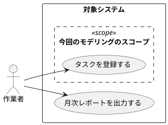
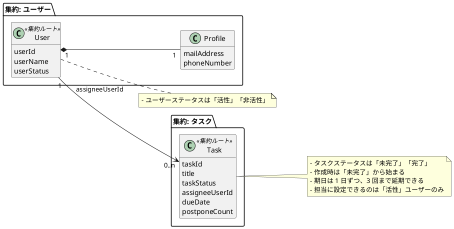

# `docs/domain` の整備

## この資料が扱う範囲

- `docs/domain/usecase/` のユースケース図
- `docs/domain/ubiquitous-language.md` のユビキタス言語
- `docs/domain/uml/` のドメインモデル図
- それぞれの更新順と同期方針

## 前提方針

- **ユースケース図を先に考える**
- **ドメインモデル図は頻繁に更新し、実装変更と乖離させない**
- **用語の追加・変更は、ユースケースと図の整合を確認してから行う**
- **依頼がない限り PNG、SVG、PDF などの画像成果物は置かない**

詳細な表記ルールを将来 `.cursor/rules/*.mdc` へ分離する場合は、そちらを優先してよい。  
ただし、そのルールがまだ存在しない間は、この資料を基準にする。

## 更新順序

1. ユースケースの前提を確認または更新する
2. 用語の意味と境界を `docs/domain/ubiquitous-language.md` に反映する
3. ドメインモデル図を `docs/domain/uml/` に反映する
4. 実装または API 仕様へ影響するなら、同じ変更単位で追従させる

## ドメインモデル図と実装の同期

### 原則

**ドメインモデル図は頻繁に更新する。** 更新の望ましいタイミングは、**該当する実装に着手する前**である。

実装を変えたのにドメインモデル図を更新しないと、**図と実装が乖離**し、設計の共有・レビュー・保守の前提が壊れる。**モデル図を先に合わせずに実装だけ変えることは避ける。**

### 扱い

- ドメインの境界、概念、ルール、集約の見え方が変わる変更では、**`docs/domain/uml/` の図を更新してから、または同じ変更単位で**実装する
- 実装差分だけが先にあり、図が古いと判断できる場合は、**図の更新を同じタスクに含める**
- 例外はタイポ、コメント、インデント、明らかにドメイン無関係のリファクタなど

## ユースケース図を先に考える

### 原則

- 境界や責務に関わる用語を増やすときは、前提ユースケースが整理済みか確認する
- ドメインモデリングの範囲を曖昧にしたまま、先にモデル図だけを描かない

## `docs/domain/ubiquitous-language.md` を更新する

### いつ使うか

- `docs/domain/ubiquitous-language.md` の作成、更新、レビューを依頼されたとき
- ドメイン用語の追加、改名、分割、統合が発生したとき
- `docs/domain/usecase/` や `docs/domain/uml/` の更新で、新しい用語や意味変更が入ったとき

### この文書の責務

- 共有するドメイン用語の **日本語名、英語名、意味** を揃える
- 必要に応じて `docs/domain/usecase/` や `docs/domain/uml/` への入口を張る
- 実装詳細、API 仕様、エンドポイント一覧の置き場にはしない

### 最初に確認する

1. `docs/domain/ubiquitous-language.md` の既存行と並び順
2. 変更の前提になる `docs/domain/usecase/` の文書
3. 関連する `docs/domain/uml/*.puml`

推測で用語を増やさず、**既存ユースケースと既存図で意味を確認してから**更新する。

### 更新手順

1. 前提ユースケースを確認する
   - 用語の追加や意味変更がユースケースに根拠づけられているかを見る
   - 境界や責務が曖昧なら、先に `docs/domain/usecase/` を更新する
2. 表の責務を守る
   - 基本列は **`日本語名 | 英語名 | 意味 | 図`**
   - `ユースケース` 列を標準列として増やさない
3. 用語を追加、更新する
   - 日本語名と英語名は両方入れる
   - 意味は 1 文から短い段落で、何を指す概念かを曖昧なく書く
   - 必要なら利用文脈を意味列に短く含める
4. リンクを整える
   - 図のセルは `ubiquitous-language.md` から見た **相対パス** を使う
   - 図がなければ空欄か `—` にする
   - ユースケース図への入口は、冒頭リンクや意味列の補足に留める
5. 周辺文書と同期する
   - 用語の改名、分割、統合をしたら `docs/domain/usecase/` と `docs/domain/uml/` の表記も確認する
   - 用語の意味変更がドメインモデル図に影響するなら、同じ変更単位で `docs/domain/uml/` も更新する

### 書き方の判断ポイント

- 用語は **コード都合の識別子** ではなく、ドメインで共有したい概念として書く
- 英語名は、コード上の識別子と合わせたい場合でも **概念名として自然か** を優先して判断する
- 意味は「何ができるか」だけでなく、**何を指すのか** を先に書く
- 図リンクは、説明不足を補うときだけ付ける
- 並び順は既存の読みやすさを優先し、無意味に全面ソートしない

### やってはいけないこと

- API パラメータ名や関数名の一覧表にすること
- 存在しない `uml/` や `usecase/` へのリンクを作ること
- 日本語名か英語名のどちらかを空欄のまま追加すること
- 境界が変わる用語追加を、ユースケース確認なしで進めること

### 編集後のチェックリスト

- [ ] `docs/domain/ubiquitous-language.md` の表が壊れていない
- [ ] 各行に `日本語名` と `英語名` がある
- [ ] 意味が短く具体的で、実装詳細に寄りすぎていない
- [ ] リンクは相対パスで、実在する `usecase/` または `uml/` を指している
- [ ] 新しい用語や改名が `docs/domain/usecase/` と `docs/domain/uml/` と矛盾していない
- [ ] 境界や責務に関わる変更では、前提ユースケースの更新要否を確認した

### 最小例

```md
# ユビキタス言語

ユースケースの入口: [ユースケース概要（タスク管理）](usecase/overview.md)

| 日本語名 | 英語名 | 意味 | 図 |
|----------|--------|------|-----|
| タスク | Task | 作業者が管理する単位の仕事。 | [タスクドメインモデル](uml/task-domain-model.puml) |
| 作業者 | Worker | タスクを作成し、操作する利用者ロール。 | — |
```

## `docs/domain/usecase/` のユースケース図

### 目的と禁止事項

- **目的**: システムの振る舞いと、**今回のドメインモデリングの対象とするユースケースの範囲**を UML ユースケース図で示す
- **ここに書かない**: 実装詳細、API の列挙

### 置き場とファイル名

- **ディレクトリ**: `docs/domain/usecase/`
- **図のソース**: `*.puml`（`@startuml` … `@enduml`）。Markdown に埋め込む場合は ` ```plantuml ` フェンスでもよい
- **ファイル名**: 小文字・kebab-case（例: `overview.puml`, `task-context.puml`）
- **説明用 Markdown** と併置してよい（例: `overview.md` から `overview.puml` へ相対リンク）

### SVG・画像出力

- **正**: `*.puml` と任意の併置 `.md`
- **PNG・SVG・PDF 等**の生成やリポジトリ追加は、**利用者が明示的に依頼したときだけ**行う
- 破線スコープ枠の見え方は、ローカルのプレビューで確認すれば足りる

### UML の表記

| 要素 | ルール |
|------|--------|
| アクター | ユーザーの **種類（ロール）**。棒人間（PlantUML の `actor`）。ラベルはビジネスで通じる呼び方にする |
| ユースケース | **楕円**。名前は **「〇〇を××する」** で統一する |
| システム境界 | 外側の `rectangle "システム名" { ... }` などで対象システムを囲む |
| 今回のスコープ | 境界内に **破線の内側枠** を置き、今回のモデリング対象だけを囲む |
| 関連 | アクターからユースケースへ `-->` 等で、主導が分かるように書く |

### PlantUML 例



新規ユースケースを追加したら、**スコープ枠を更新**するか、意図的に枠外に置く理由が図から分かるようにする。

### 編集後のチェックリスト

- [ ] `*.puml` が `@startuml` / `@enduml` で閉じている
- [ ] アクター、ユースケース名、システム境界、スコープ枠が指針どおり
- [ ] ユースケース名が「〇〇を××する」形式で統一されている
- [ ] 併置する `.md` がある場合、パスと説明を更新した
- [ ] 登場するドメイン用語を `docs/domain/ubiquitous-language.md` へリンクまたは一行追記を検討した
- [ ] 依頼がない限り PNG、SVG、PDF 等をリポジトリに追加していない

## `docs/domain/uml/` のドメインモデル図

### 目的

- **目的**: 概念、関連、集約、境界、ルールや制約を、理解しやすい **簡易クラス図** として表現する
- **この図で表すもの**: 代表的な属性、多重度、集約境界、集約ルート、ドメイン知識
- **この図で表しすぎないもの**: メソッド一覧、実装都合の DTO や ORM 詳細、全カラムの列挙

### 置き場

- **ディレクトリ**: `docs/domain/uml/`
- **図のソース**: `*.puml`
- **ファイル名**: 小文字・kebab-case（例: `task-domain-model.puml`, `task-status-state.puml`）

### SVG・画像出力

- **正**: `*.puml`
- **PNG・SVG・PDF 等**の生成やリポジトリ追加は、**利用者が明示的に依頼したときだけ**行う

### 作図前に決めること

1. **前提ユースケース**: どのユースケースを図の前提にするか。未整理なら先に `docs/domain/usecase/` を更新する
2. **境界づけられたコンテキスト**: この図がどのモデルの境界を扱うか。文脈が違うなら、図を分ける
3. **集約**: 強い整合性をどこで守るか。集約ルートは何か
4. **関連の種類**: 集約内のインスタンス参照か、集約外の ID 参照か
5. **ルールや制約の表現**: ノートの箇条書きで十分か。状態遷移図へ切り出した方が明快か

### 作図時の判断ポイント

- オブジェクトは `class` を使い、**代表的な属性のみ**を書く。メソッドは書かない
- 関連には **多重度** を付ける
- ルールや制約は、まず **ノートの箇条書き** で表す
- 集約境界は `package` や `rectangle` で囲み、集約ルートが分かるようにする
- 集約内の参照は `*--`、集約外の参照は `-->` / `..>` に書き分ける
- 境界をまたぐ関連には、必要なら `task.userId` のような **ID 参照と分かる属性名やノート** を添える
- 具体例は、理解が速くなるときだけ短いノートで補足する

### DDD モデリングの観点

- **強い整合性が必要なものを 1 つの集約にする**
- **1 トランザクションは 1 集約に閉じる** 前提で境界を考える
- 集約を大きくしすぎない。更新時に不要に広いロックや読込範囲が生まれるなら、境界を見直す
- すべてのオブジェクトは、どこかの集約に所属させる前提で考える
- 1 つの用語に複数の意味が混ざるなら、**境界づけられたコンテキストを分ける**

### 状態遷移図を併用するとよい場合

次のようなときは、ルールをノートに詰め込まず **別ファイルの状態遷移図** を追加する。

- 状態が 3 つ以上あり、遷移条件が重要
- 作成、更新、承認、完了などで状態変化を追う必要がある
- 文章だと遷移の抜け漏れが起きやすい

例: `task-domain-model.puml` と `task-status-state.puml`

### 作図手順

1. 前提ユースケースとコンテキストを確認する
2. オブジェクトを洗い出し、代表属性だけを書く
3. 関連を引き、**多重度** を付ける
4. 集約境界を囲み、集約ルートを明示する
5. 集約内は `*--`、集約外は `-->` / `..>` に書き分ける
6. 生成、更新、整合性、前提条件などを **ノートの箇条書き** で書く
7. ルールが複雑なら状態遷移図を別 `*.puml` へ切り出す

### 最小テンプレート

次のテンプレートの名前や属性は **あくまで汎用例**。実際の作図では、対象コンテキストのユビキタス言語に置き換える。



### 編集後のチェックリスト

- [ ] 図の前提となるユースケースがある
- [ ] `docs/domain/uml/` 配下の `*.puml` で管理している
- [ ] 依頼がない限り PNG、SVG、PDF 等をリポジトリに追加していない
- [ ] メソッドを書いていない
- [ ] 代表属性、関連、多重度が入っている
- [ ] 集約境界と集約ルートが分かる
- [ ] 集約内 `*--` と集約外 `-->` / `..>` を書き分けている
- [ ] ルールや制約がノートまたは別図で表現されている
- [ ] 用語が `docs/domain/ubiquitous-language.md` と矛盾していない
- [ ] 必要なら `docs/domain/ubiquitous-language.md` に用語を追加し、意味を更新し、`uml/` 配下への相対リンク追加を検討した
- [ ] 図を増やしすぎる前に、境界づけられたコンテキストの分割を検討した
